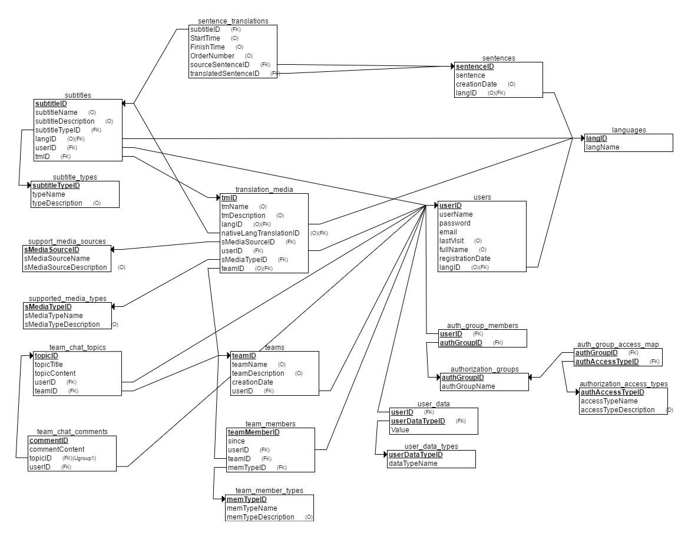

# Minny Online Translation System
Ses, video, doküman gibi multimedya dosyalarının dilden başka bir dile **kolay** ve **hızlı** bir şekilde çevirelmesini amaçlayan bir sistemdir.

### Proje Amacı
Dünyanın her tarafından kullanıcıların sisteme kayıt olup çeviri işlemlerini kolay ve hızlı bir şekilde yapabileceği bir internet hizmeti hazırlamak.

### Proje ile Yapılabilecekler
- Kullanıcılar üye olup sistemi daha etkili bir şekilde kullanabilecek 
- Kendi takımlarını (team) kurarak ekip çalışması yapabilecekler
- Takım üyeleri **hiyerarşik** bir yapı içinde takım içinde görevlendirilecek
- Her bir öğe için her dilde yapılan çeviriler veritabanında tutulacak
- İstenirse aynı dilden birkaç çeviri yapılabilecek
- Takım içi **sohbet odası** olacak
- Yapılan çeviri belirlenen formatlarda çıktı alınabilecek
- Kullanıcılar arasında rekabet olması için **ranking** sistemi olacak
- Sistemde moderatörler olacak, yapılan çevirileri kontrol edip onaylayacak. Red etme yetkisine de sahip olacak. 
- Çevirmenlerin yapmış olduğu çalışmalara göre seviyeleri olacak.
- Sistem yöneticisi olacak. 
- Herhangi bir şekilde çeviri yapmayıp sadece mevcut öğenin transkripsiyonunu (ana dilde altyazı hazırlanması) yapacak kullanıcılar da sistemde olacak. Örneğin X videosu türkçe bir içerikte hazırlanmış. Bu videonun başka dillere çevrilebilmesi için öncelikle bu videonun türkçe metninin yazılması gerekiyor. Bu işlemi yapacak kullanıcı tipi olacak. (transkripsiyon)
- Materyaller sisteme başka bir platformdan (youtube, facebook, twitter, wikipedia, dailymotion, flickr, soundcloud, google images vs.) entegre edilebilecek.

### Yazılım
Projenin yazılım ihtiyaçlarını karşılayacak dil olarak **PHP** kullanılması esneklik ve kolay kullanımı açısından tercih edilmiştir. Proje **MVC** yapısına göre şekillenmektedir. İsteyenler örnek dökümanlara buradan erişebilir;

[Kaynak1](https://www.sitepoint.com/the-mvc-pattern-and-php-1/)
[Kaynak2](http://requiremind.com/a-most-simple-php-mvc-beginners-tutorial/)

### Veritabanı
Projede veritabanı uygulaması olarak **MySql** kullanılmıştır. Proje için Entitylerin örneği aşağıdadır. Gerçek sistemde bulunan kolon adları ve yapısı farklılık gösterebilir. Gerekli Table kodu <kbd>database/table.sql</kbd> sorgu dosyasında mevcuttur.

Veritabanı yazılımında temel şablon şu şekilde tercih edilmiştir.

|Öğe|Kural|Örnek|
|----|------|-------|
|Tablo İsimleri|Bütün harfler küçük,kelimeler alt tire ile ayrılmış|user_data|
|Primary Key|'**pk**' ile başlayıp sonraki kelimeler büyük ile başlar,sonuna '**ID**' takısı alır,kelimeler bitişik|pk_user_id|
|Column|ilk kelime küçük sonrakiler büyük harfle başlar,kelimeler bitişik|commentContent|
|Foreign Key|primary key ile aynı özellikleri taşır|subtitles > pk_user_id|

> **Not**
> - Database Relational Scheme bir tool yardımı ile otomatik oluşturulmuştur. Düzenlenmesi zaman aldığı için değiştirilmemiştir. Bu yüzden isimler ve bazı detaylar resimde güncel olarak görünmeyebilir.
> - Tablodaki bütün primary key'ler **pk**[tablo_ismi]**ID** olarak düzenlendi. 
